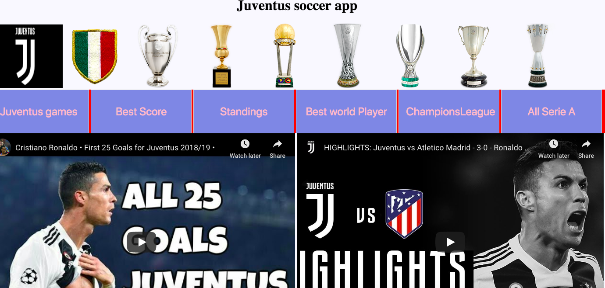

# soccergithubmichelecreanza.github.io

soccer

My first project is about to begin

pull

create a branc

Michele soccer app

soccergithubmichelecreanza.github.io
soccer link https://github.com/michelecreanza/soccergithubmichelecreanza.github.io

Technologies Used:

api.football-data
HTML
CSS
Javascript
Jquery
Description:

A Competition represents a football league (e.g. Premiere League) or a tournament (e.g. FA-Cup) or a combination of both (e.g. Champions League, having playoffs, a group stage and knock-out rounds). All Competitions can be accessed via a particular id or a human readable code. A Competition consists of Seasons, that hold a number of scheduled games named Matches. A certain number of Teams participate in one particular Season. Since v2 there's even more Resources: Persons appear in squads and lineups as Players and Coaches or in matches as Referees. See all Resources listed on the left and click for example responses and available filters.

Headers

H1
H2
H3
H4
H5
H6
Alternatively, for H1 and H2, an underline-ish style:

Alt-H1
Alt-H2
H1 H2 H3 H4 H5 H6 Alternatively, for H1 and H2, an underline-ish style:

Alt-H1 Alt-H2 Emphasis Emphasis, aka italics, with asterisks or underscores.

Strong emphasis, aka bold, with asterisks or underscores.

Combined emphasis with asterisks and underscores.

Strikethrough uses two tildes. Scratch this. Emphasis, aka italics, with asterisks or underscores.

Strong emphasis, aka bold, with asterisks or underscores.

Combined emphasis with asterisks and underscores.

Strikethrough uses two tildes. Scratch this.

Lists (In this example, leading and trailing spaces are shown with with dots: ⋅)

First ordered list item
Another item ⋅⋅\* Unordered sub-list.
Actual numbers don't matter, just that it's a number ⋅⋅1. Ordered sub-list
And another item.
⋅⋅⋅You can have properly indented paragraphs within list items. Notice the blank line above, and the leading spaces (at least one, but we'll use three here to also align the raw Markdown).

⋅⋅⋅To have a line break without a paragraph, you will need to use two trailing spaces.⋅⋅ ⋅⋅⋅Note that this line is separate, but within the same paragraph.⋅⋅ ⋅⋅⋅(This is contrary to the typical GFM line break behaviour, where trailing spaces are not required.)

Unordered list can use asterisks
Or minuses
Or pluses First ordered list item Another item Unordered sub-list. Actual numbers don't matter, just that it's a number
Ordered sub-list

And another item.

You can have properly indented paragraphs within list items. Notice the blank line above, and the leading spaces (at least one, but we'll use three here to also align the raw Markdown).

To have a line break without a paragraph, you will need to use two trailing spaces. Note that this line is separate, but within the same paragraph. (This is contrary to the typical GFM line break behaviour, where trailing spaces are not required.)

Unordered list can use asterisks Or minuses Or pluses Links

Resources Used:

https://api.football-data.org/v2/matches

(Sub)Resource Action URI Filters Sample Competition List all available competitions. /v2/competitions/ areas={AREAS} plan={PLAN} Open Competition List one particular competition. /v2/competitions/2000 Open Team List all teams for a particular competition. /v2/competitions/{id}/teams season={YEAR} stage={STAGE} Open Standings Show Standings for a particular competition. /v2/competitions/{id}/standings standingType={standingType} Open Match List all matches for a particular competition. /v2/competitions/{id}/matches dateFrom={DATE} dateTo={DATE} stage={STAGE} status={STATUS} matchday={MATCHDAY} group={GROUP} season={YEAR} Open Scorers List goal scorers for a particular competition. /v2/competitions/{id}/scorers limit={LIMIT} Open Match List matches across (a set of) competitions. /v2/matches competitions={competitionIds} dateFrom={DATE} dateTo={DATE} status={STATUS} Open Match Show one particular match. /v2/matches/{id} Open Match Show all matches for a particular team. /v2/teams/{id}/matches/ dateFrom={DATE} dateTo={DATE} status={STATUS} venue={VENUE} limit={LIMIT} Open Team Show one particular team. /v2/teams/{id} - Open Areas List all available areas. /v2/areas/ - Open Areas List one particular area. /v2/areas/{id} - Open Player List one particular player. /v2/players/{id} - Open Player Show all matches for a particular player. /v2/players/{id}/matches dateFrom={DATE} dateTo={DATE} status={STATUS} competitions={competitionIds} limit={LIMIT} Open Filters and their data types Filter Type Description / Possible values id Integer /[0-9]+/ The id of a resource. matchday Integer /[1-4]+[0-9]\*/ season String /YYYY/ The starting year of a season e.g. 2017 or 2016 status Enum /[A-Z]+/ The status of a match. [SCHEDULED | LIVE | IN_PLAY | PAUSED | FINISHED | POSTPONED | SUSPENDED | CANCELED] venue Enum /[A-Z]+/ Defines the venue (type). [HOME | AWAY] dateFrom / dateTo String /YYYY-MM-dd/ e.g. 2018-06-22 stage String /[A-Z]+/ Check the season node for available stages of a particular competition/season. plan String /[A-Z]+/ [ TIER_ONE | TIER_TWO | TIER_THREE | TIER_FOUR ] competitions String /\d+,\d+/ Comma separated list of competition ids. group String /[A-Z]+/ Allows filtering for groupings in a competition. limit Integer /\d+/ Limits your result set to the given number. Defaults to 10. standingType String /[A-Z]+/ [ TOTAL (default) | HOME | AWAY ]

API info Filter Type Description / Possible values id Integer /[0-9]+/ The id of a resource. matchday Integer /[1-4]+[0-9]\*/ season String /YYYY/ The starting year of a season e.g. 2017 or 2016 status Enum /[A-Z]+/ The status of a match. [SCHEDULED | LIVE | IN_PLAY | PAUSED | FINISHED | POSTPONED | SUSPENDED | CANCELED] venue Enum /[A-Z]+/ Defines the venue (type). [HOME | AWAY] dateFrom / dateTo String /YYYY-MM-dd/ e.g. 2018-06-22 stage String /[A-Z]+/ Check the season node for available stages of a particular competition/season. plan String /[A-Z]+/ [ TIER_ONE | TIER_TWO | TIER_THREE | TIER_FOUR ] competitions String /\d+,\d+/ Comma separated list of competition ids. group String /[A-Z]+/ Allows filtering for groupings in a competition. limit Integer /\d+/ Limits your result set to the given number. Defaults to 10. standingType String /[A-Z]+/ [ TOTAL (default) | HOME | AWAY ] Example Requests See todays' matches of your subscribed competitions: https://api.football-data.org/v2/matches Get all matches of the Champions League: https://api.football-data.org/v2/competitions/CL/matches See all upcoming matches for Real Madrid: https://api.football-data.org/v2/teams/86/matches?status=SCHEDULED Get all matches where Gigi Buffon was in the squad: https://api.football-data.org/v2/players/2019/matches?status=FINISHED Check schedules for Premier League on matchday 11: https://api.football-data.org/v2/competitions/PL/matches?matchday=11 Get the league table for HOME matches only of Belgiums Jupiler Pro League: https://api.football-data.org/v2/competitions/BJL/standings?standingType=HOME See best 10 scorers of Italy's top league (scorers subresource defaults to limit=10): https://api.football-data.org/v2/competitions/SA/scorers
